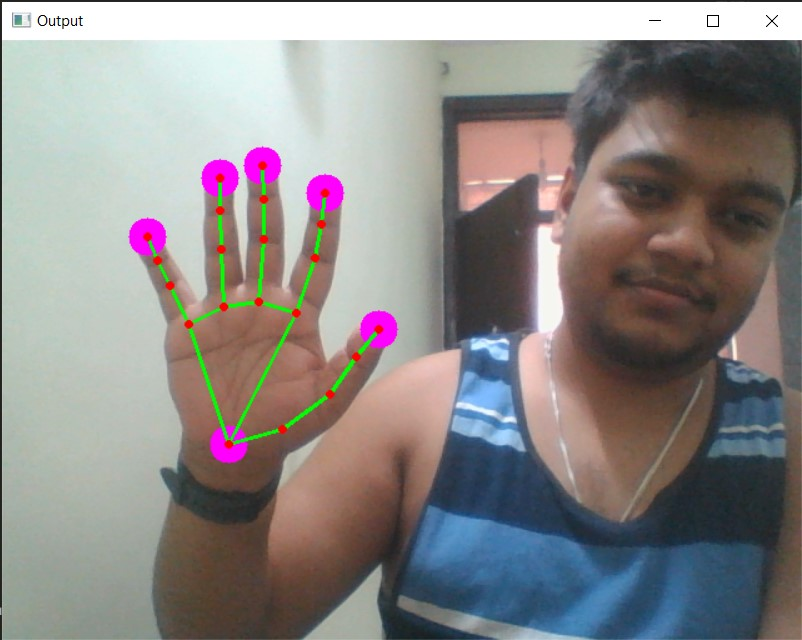

# OpenCV Hand Tracking
A project using OpenCV and Mediapipe library to track the hand landmarks.

## System Requirements
* Python 3.2 - 3.7
* No GPU requirements

## Installation
```sh
pip3 install -r requirements.txt
```
## Run
```sh
python3 main.py
```
## License
Just copy and use it. I am not gonna complaint

## Screen Shots
<p align="center"></p>
## Reference
[Mediapipe](https://google.github.io/mediapipe/)
[OpenCV](https://pypi.org/project/opencv-python/)
