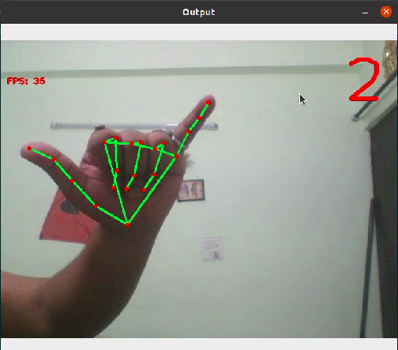
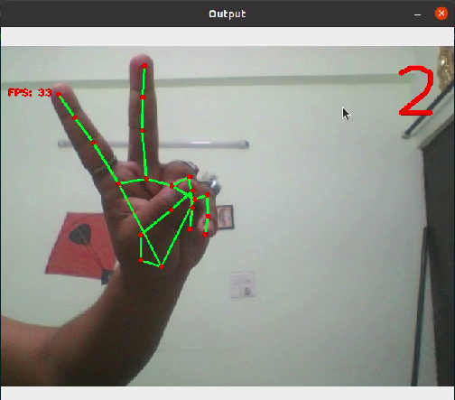
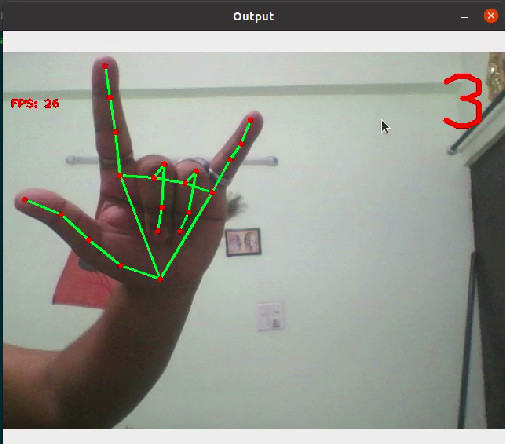
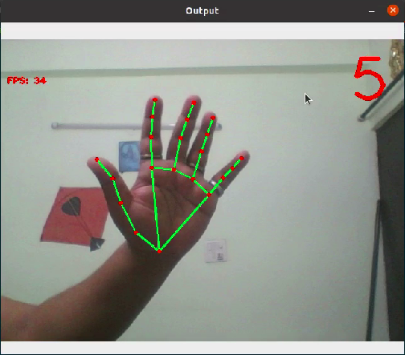

# Mediapipe Projects


A set of project using OpenCV and Mediapipe library.

## System Requirements

* Ubuntu 20.04
* Python 3.8.5
* **No GPU** requirements

## Installation

Typically, a pycharm based project.

* ### Ubuntu 20.04
  ```sh
  $ pip3 install -r requirements_linux.txt
  ```
* ### Windows 10
  ```shell
  /> pip3 install -r requirements_win.txt
  ```  

## Utilities

- [X] Hand Tracking
- [X] Face Detection
- [ ] Pose Estimation

## Projects

* ### P1: Hand Gesture based system volume control
  Real time volume control using mediapipe hand gesture recognition system.
    ```shell
    cd MediaPipe-Project/Projects/P1-vol_control
    python3 vol_control.py
    ```
  Compatibility:
    - [X] Windows 10
    - [X] Ubuntu 20.04

* ### P2: Finger Counter
  Real time right-hand finger counting
    ```shell
    cd MediaPipe-Project/Projects/P2-finger_counting
    python3 finger_counter.py
    ```
  **Compatibility**:
    - [X] Windows 10
    - [X] Ubuntu 20.04
  
  **Gallery**:
  
      
      

## Reference

* [Mediapipe](https://google.github.io/mediapipe/)
* [OpenCV](https://pypi.org/project/opencv-python/)
* [pycaw](https://github.com/AndreMiras/pycaw)
* [alsaaudio](https://pypi.org/project/pyalsaaudio/)
